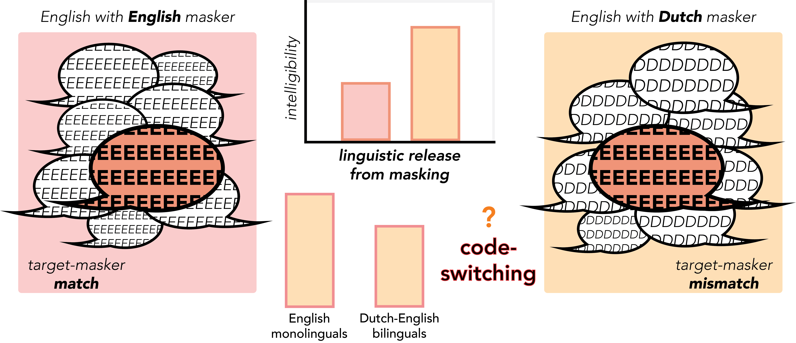

<!--     pandoc_args: [ -->
<!--       "--lua-filter", "~/Mirror/format_files/multiple-bibliographies-new.lua", -->
<!--       "--lua-filter", "/Library/Frameworks/R.framework/Versions/4.2/Resources/library/rmdfiltr/replace_ampersands.lua" -->
<!--       ] -->
<!-- bibliography: cs_project.bib -->
<!-- nocite: "@*" -->
<!-- link-citations: no -->
<!-- csl: apa7_auth.csl -->

```{r setup, include = FALSE, message = FALSE, warning = FALSE}
## R setup ##

# knitr settings
# chooseCRANmirror(graphics = FALSE, ind = 1)
knitr::opts_chunk$set(echo = FALSE, warning = FALSE, message = FALSE)
# knitr::knit_hooks$set(document  =  function(x) {sub('\\usepackage[]{color}', '\\usepackage{xcolor}', x, fixed  =  TRUE)})
```

```{r load, echo = FALSE}
source("/Users/hollyzaharchuk/Mirror/Project_CS/data/8_visualize.R")
```

# Research background

```{r lrm, out.width = "100%", out.extra = ""}

```

# Participants

```{r par_info, out.width = "100%", out.extra = "", dpi = 300}
lang_dom
```

# Procedure

```{r proc, out.width = "100%", out.extra = ""}
knitr::include_graphics("proc_v2.png")
```

# Analyses

<div style = "text-align: center"><font size = 40>Accuracy benefit for English versus Spanish decreases by ~20% in code-switched versus single-language sentences</font></div>

```{r exp_2, out.width = "100%", out.extra = "", dpi = 300}
exp_2
```

<div style = "text-align: center"><font size = 40>Removing single-language stimuli shifts transcription advantage from pre-switch keywords to post-switch keywords</font></div>

```{r cs_sent, out.width = "100%", out.extra = "", dpi = 300}
cs_sent_plot
```

<div style = "text-align: leftt"><font size = 4>*Keyword accuracy (1,0) and RT (inverse transformed) analyzed via linear mixed-effects models controlling for keyword position, language dominance (difference between English and Spanish LexTALE), and code-switching frequency (mean of L1-switch, L2-switch, and contextual switch responses on bilingual switching questionnaire; see Rodriguez-Fornells et al., 2012)*</font></div>

<div style = "text-align: center"><font size = 40>Code-switched Spanish words are more sensitive to masker language than code-switched English words</font></div>

```{r cs_word, out.width = "100%", out.extra = "", dpi = 300}
cs_word_plot
```

# Stimulus examples

```{r method_info, out.width = "100%", out.extra = ""}
ejemplo_tab
```

# Result summary

```{r sum_info, out.width = "100%", out.extra = ""}
analysis_tab
```

# References and acknowledgements


<div style = "text-align: left"><font size = 6>Brouwer, S., Van Engen, K. J., Calandruccio, L., & Bradlow, A. R. (2012).</font></div>
<div style = "text-align: left"><font size = 6>Fernandez, C. B., Litcofsky, K. A., & Van Hell, J. G. (2019).</font></div>
<div style = "text-align: left"><font size = 6>Lecumberri, M. L. G., Cooke, M., & Cutler, A. (2010).</font></div>
<div style = "text-align: left"><font size = 6>Rodriguez-Fornells, A., Krämer, U. M., Lorenzo-Seva, U., Festman, J., & Münte, T. F. (2012).</font></div>
<div style = "text-align: left"><font size = 6>Viswanathan, N., Kokkinakis, K., & Williams, B. T. (2018).</font></div>

<div style = "text-align: right"><font size = 6>Holly A. Zaharchuk: hzaharchuk@psu.edu</font></div> <div style = "text-align: right"><font size = 6>University Graduate Fellow (UGF)</font></div>